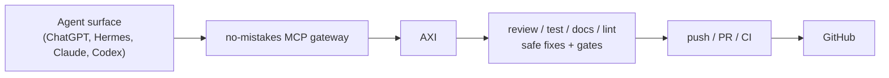

Agent surfaces read repositories well and write to them badly. Direct forge-write
actions are permission-gated, flaky, or simply missing, and when they do work
they skip every check the change should have passed.

The MCP gateway turns that around. no-mistakes already owns the delivery
pipeline - `intent → rebase → review → test → document → lint → push → PR → CI` -
and `no-mistakes mcp serve --stdio` exposes it over the Model Context Protocol,
so an agent surface hands work to the gate instead of writing to the forge.



The gateway is an adapter, not a second workflow engine. It starts and watches
runs, normalizes what AXI reports, and stops. no-mistakes remains the only thing
that publishes.

## Starting the server

```bash
no-mistakes mcp serve --stdio
```

stdio is the only v1 transport, and `--stdio` is required so adding another
later cannot silently change what the command does. stdout carries MCP protocol
messages only; every diagnostic goes to stderr. Launch it from an MCP client
rather than reading it in a terminal.

A typical client entry:

```json
{
  "mcpServers": {
    "no-mistakes": {
      "command": "no-mistakes",
      "args": ["mcp", "serve", "--stdio"]
    }
  }
}
```

The server needs the same environment `no-mistakes` normally runs in - `PATH`
reaching your agent binary, and `NM_HOME` if you relocate the config directory.

## Allowlisting repositories

The gateway refuses every repository by default. List the roots it may serve in
your global config:

```yaml
# ~/.no-mistakes/config.yaml
mcp:
  allowed_repo_roots:
    - /Users/you/src
    - /srv/repos
```

Each `repo_path` a caller passes is canonicalized - made absolute, with symlinks
resolved - and must then lie under one of those roots. A path that escapes its
root through `..` or a symlink is refused outright; it is never quietly
normalized back into the root. A path that is not a git repository is refused
too.

`mcp.allowed_repo_roots` is a global-only setting with no repository
counterpart. It decides which repositories this machine will mutate on an
external agent's behalf, so a pushed branch has no way to widen it. See
[Global Config](/no-mistakes/reference/global-config/).

## The v1 tools

| Tool | Writes? | What it does |
| --- | --- | --- |
| `nomistakes_status` | read-only | The run for a repository's current branch, or a named run: state, gate findings, PR URL, full head SHA, skipped validation, next action. |
| `nomistakes_run` | write | Starts a run, or reattaches to the one in flight, and returns at the first gate, the terminal outcome, or the bounded wait. Requires `intent`. |
| `nomistakes_respond` | write | Answers the gate a run is parked at with `approve`, `fix`, or `skip`. |
| `nomistakes_logs` | read-only | A bounded tail of one pipeline step's log. `tail_lines` defaults to 80 and is capped at 500. |
| `nomistakes_sync` | write (guarded) | Reads branch synchronization; applies it or returns custody only when no-mistakes' own next action authorizes exactly that. |
| `nomistakes_doctor` | read-only | Whether the repository is initialized, whether the daemon is running, which agents this machine can launch. |

There is deliberately no merge tool, no push tool, and no abort tool. Merging is
a human decision; publishing happens inside no-mistakes; aborting is a
between-runs action that is easy to misuse mid-run.

### `intent` is not optional

`nomistakes_run` requires `intent`, and it must be what the user set out to
accomplish - the goal, its constraints, its exclusions, its acceptance criteria -
not a description of the diff. The pipeline uses it directly instead of
inferring one from a transcript, so a lossy summary produces a run validating
something other than the user's actual ask.

## Handling gates

A run pauses at a gate when a step produces findings that need a decision. The
receipt returns the gate, its findings, and their actions, and stops.

```mermaid
flowchart TD
  gate["Gate returned"] --> class{"Finding action"}
  class -- "auto-fix" --> fix["Agent may request fix"]
  class -- "no-op" --> approve["Agent may approve"]
  class -- "ask-user" --> human["Return to the human"]
  human --> decision["Human decides"]
  decision --> respond["respond with user_decision"]
```

- **`auto-fix`** - mechanical and inside the approved intent. The agent may ask
  for a fix.
- **`no-op`** - informational. The agent may approve.
- **`ask-user`** - the pipeline is saying it will not decide this. The receipt
  sets `requires_user_decision: true`, and `nomistakes_respond` refuses the call
  outright - the daemon is never contacted. Put the findings in front of the
  human, then call again with `user_decision` carrying the decision they gave.
  Do not fill that field in on their behalf; it is the one thing standing
  between a referred question and an unattended answer.

  The refusal is re-checked against the live gate the response would land on,
  not only against the gate you last read, so a run that advances into an
  ask-user gate while you are composing a response is still refused.

A protected-path refusal behaves the same way: the pipeline declined to act, so
the gateway will not act for it.

`nomistakes_run` also refuses the repository's own default branch
(`default_branch_refused`). Changes reach it through the pull request
no-mistakes opens, never a direct push.

A caller running inside an active no-mistakes validation step is refused any
mutating tool with `nested_gate_context`. That caller owns one phase, not the
pipeline. Read-only tools stay available to it.

## Reading the receipt

Every tool returns one shape:

```json
{
  "ok": true,
  "operation": "run",
  "repo_path": "/Users/you/src/project",
  "run_id": "01M2G2V61ASB86M30QXM6G5C4H",
  "branch": "feature/example",
  "head_sha": "71d34d6e3d30f61ecd0696a90c8664c2ec3f5a15",
  "state": "awaiting_decision",
  "step": "review",
  "pr_url": null,
  "ci": null,
  "requires_user_decision": true,
  "findings": [
    { "id": "r1", "severity": "warning", "action": "ask-user", "file": "a.go", "description": "..." }
  ],
  "next_action": { "code": "respond", "allowed": ["approve", "fix", "skip"] },
  "automatic_skips": [],
  "warnings": []
}
```

A refusal replaces the body with a typed, actionable error:

```json
{
  "ok": false,
  "operation": "run",
  "error": {
    "code": "repo_not_allowed",
    "message": "repo_path \"/tmp/elsewhere\" is outside the configured repository roots.",
    "remediation": "Add the canonical repository root to mcp.allowed_repo_roots in the no-mistakes global config."
  }
}
```

### What the states mean

| `state` | Meaning |
| --- | --- |
| `idle` | No run exists for this branch. |
| `running` | A run is in flight and has not parked. |
| `awaiting_decision` | Parked at a gate. See `findings` and `requires_user_decision`. |
| `checks-passed` | CI is green (or the repository's trusted no-CI declaration applies) and the PR is ready for a human to merge. |
| `passed` | The run completed with every step accounted for. |
| `passed-with-skips` | The run completed, but publication or CI verification did not run. See `automatic_skips`. |
| `passed-with-override` | A human approved past a still-failing live check. |
| `failed` / `cancelled` / `ci-monitor-interrupted` | The run did not pass. |

Three of these are easy to conflate and must not be:

- **`checks-passed` is the only CI verdict.** The `ci` field carries
  `"checks-passed"` there and `null` everywhere else. No other state is promoted
  to it.
- **`passed-with-skips` is not CI-ready.** It means validation the pipeline
  decided to skip did not run, and `automatic_skips` says which steps and why.
  Report the missing evidence; do not report the change as verified.
- **`passed-with-override`** means a human went past a failing check
  deliberately. It is a pass with a footnote, not a clean one.

`head_sha` is always the full 40-character commit. An abbreviated SHA cannot be
compared against a forge, which makes it useless as evidence.

### Bounded waits

`nomistakes_run` and `nomistakes_respond` accept `wait_seconds` (default eight
minutes, capped at thirty) so a call returns before your own tool budget
expires. When that wait
elapses the run keeps going: the receipt reports `running`, warns that the hold
ended, and sets `next_action.code` to `reattach`. It is not a failure and not a
terminal state.

## The agent loop

```text
1. nomistakes_status
2. nomistakes_run(intent)
3. while the receipt returns a gate:
     auto-fix  -> nomistakes_respond(action: "fix", finding_ids: [...])
     no-op     -> nomistakes_respond(action: "approve")
     ask-user  -> return the findings to the human; respond with user_decision
4. on a terminal receipt, report the PR URL, the full head SHA, and any
   automatic_skips
```

Favor explicit state over guessing. Every receipt says what it knows and what
to do next; nothing else needs to be inferred.

## What the gateway will not do

- It does not call a forge write API. Publication is the push and PR steps
  inside no-mistakes.
- It cannot merge a pull request. That is a human decision, and no tool exists
  for it.
- It never pushes directly to a default branch.
- It never resolves an `ask-user` finding on its own.
- It never reports CI as green on any state but `checks-passed`.
- It holds no run state. Stopping the server leaves an active run running; a
  fresh server reattaches to it.
